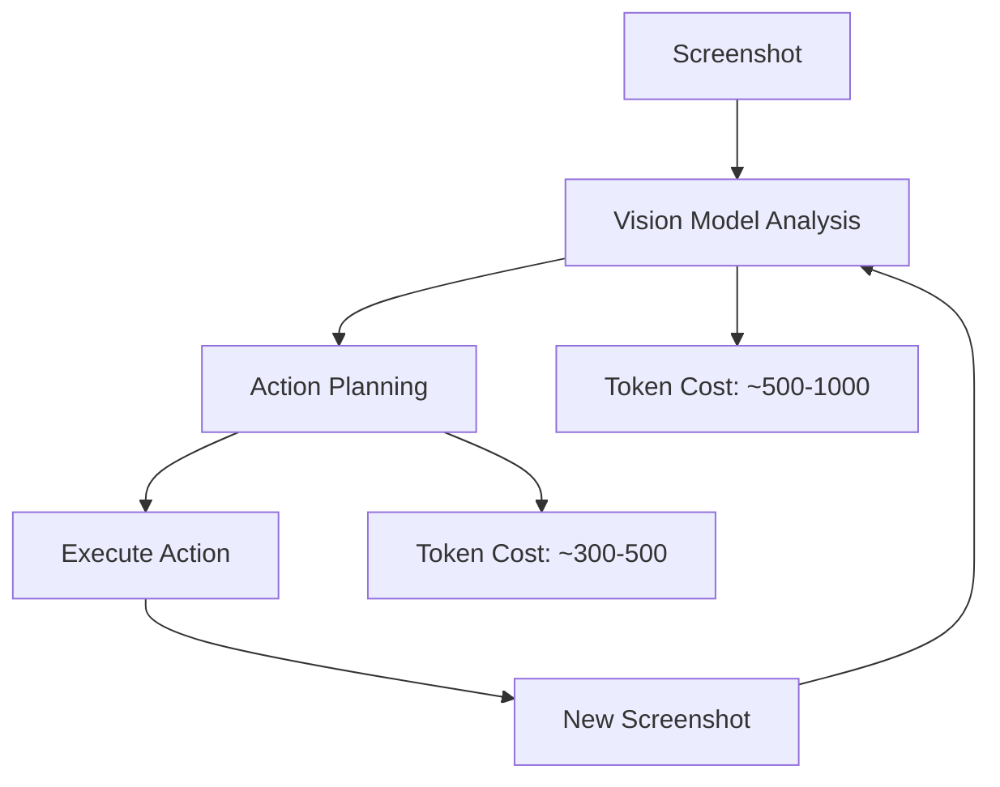

So this weekend I went down a pretty wild rabbit hole. It all started when my friend **Jeffrey Zang** showed me this insane hackathon project he built at Waterloo called **"Opus"** ([check it out here](https://github.com/jeffrey-zang/opus)). 

Watching his demo was honestly mind-blowing - like, an AI that can actually *use* your computer the way you would? That got me way too curious for my own good.


## What Even Are Computer Using Agents?

Before I get into my testing adventure, let me explain what **Computer Using Agents (CUAs)** actually are, because this stuff is genuinely cool:

Basically, they're AI systems that can see your screen, understand what's happening, and then click, type, and navigate just like a human would. No special APIs needed - they literally just look at pixels and figure out what to do.

### How Opus Works (From What I Could Tell)

Jeffrey's project uses Microsoft's Opus architecture, which is pretty clever:

| Component | What It Does | Why It's Cool |
|-----------|-------------|---------------|
| **Vision-Language Models** | "Sees" and understands your screen | Like having AI eyes that know what buttons are |
| **Action Planning** | Breaks down complex tasks into steps | "To send an email, first open Gmail, then..." |
| **Execution Engine** | Actually performs the clicks/typing | The hands that do the work |
| **Feedback Loops** | Learns from mistakes | "Oops, wrong button, let me try again" |

## Down the Rabbit Hole: Microsoft UFO2

After seeing Jeffrey's demo, I had to try this myself. That's when I found Microsoft's latest research project: **UFO2** ([GitHub link](https://github.com/microsoft/UFO)). 


This thing just came out in April 2025 and it's supposed to be state-of-the-art for Computer Using Agents.

### Setting Up UFO2 (The Fun Part)

Here's how I got it running on my Windows machine:

```bash
# Clone the repository
git clone https://github.com/microsoft/UFO.git
cd UFO

# Install dependencies
pip install -r requirements.txt

# Set up your OpenAI API key
export OPENAI_API_KEY="your-api-key-here"

# Run UFO2
python main.py
```

```bash
Welcome to use UFO🛸, A UI-focused Agent for Windows OS Interaction. 
 _   _  _____   ___
| | | ||  ___| / _ \
| | | || |_   | | | |
| |_| ||  _|  | |_| |
 \___/ |_|     \___/
Please enter your request to be completed🛸:
```

## The Reality Check: Testing UFO2

I decided to test it with what seemed like a super simple task:

> **My Test Prompt:** "Open File Explorer, navigate to the Documents folder, right-click in an empty space, create a new text file named 'todo.txt', and open it in Notepad"

### The Results Were... Interesting

| Metric | Result | My Reaction |
|--------|--------|-------------|
| **Cost** | $1.12 (GPT-4o Turbo) | "Wait, that much for one task??" |
| **Time** | 8 minutes | "I could do this in 10 seconds..." |
| **Success Rate** | Failed multiple times | "This is harder than it looks" |
| **Attempts** | ~6-7 tries | "At least it's persistent?" |

### What Went Wrong (And Why)

The system kept getting stuck in these weird loops:

```python
# Pseudo-code of what I think was happening
while task_not_complete:
    take_screenshot()
    analyze_image()  # Expensive API call
    plan_action()    # Another expensive call
    execute_action()
    
    if action_failed:
        backtrack()  # More API calls
        try_again()  # Even more calls
```

**Problems I noticed:**
- Clicked on wrong folders constantly
- Got confused by similar-looking UI elements  
- Kept trying the same failed action multiple times
- Used TONS of tokens for each screenshot analysis

## Breaking Down Why UFO2 Is So Expensive


The architecture is honestly pretty brilliant, but it's also super **token-heavy**:

### UFO2's Processing Pipeline



| Step | Token Usage | Why It's Expensive |
|------|-------------|-------------------|
| **Screen Analysis** | 500-1000 tokens | Each screenshot needs detailed vision processing |
| **Action Planning** | 300-500 tokens | Complex reasoning about next steps |
| **Error Recovery** | 200-400 tokens | When it messes up (which is often) |
| **Context Maintenance** | 100-300 tokens | Remembering what it's supposed to be doing |

**Total per action:** ~1000-2000 tokens
**My simple task:** Probably used 15,000+ tokens total

## Current State: The Good and The Frustrating

### What's Cool About CUAs Right Now

- **Actually works** (eventually) - like, it really can use your computer
- **No API required** - works with any app or website
- **Surprisingly good at complex reasoning** - it understands context way better than I expected
- **Getting better fast** - the technology is improving rapidly

### What's... Not So Great

| Problem | Impact | Example |
|---------|--------|---------|
| **Super Expensive** | $1+ for simple tasks | My todo.txt task cost more than a coffee |
| **Really Slow** | Minutes for 10-second tasks | Faster to just do it myself |
| **Unreliable** | Fails frequently | Spent more time fixing than working |
| **Token Heavy** | Costs scale quickly | 5 tasks = lunch money |

## What I Haven't Tried Yet: OpenAI's Operator

I keep hearing about **OpenAI's Operator** system, which supposedly is way more optimized than UFO2. From what I've read, it might be better because:

- Better integration between vision and action models
- More efficient token usage (hopefully?)
- Trained specifically on computer interaction tasks
- Probably has better error recovery

**Code snippet for when I get access:**
```python
# What I imagine Operator's API might look like
from openai import Operator

agent = Operator()
result = agent.execute_task("Create a new text file called todo.txt")
print(f"Task completed in {result.time_taken} seconds for ${result.cost}")
```


## My Vision: The Ultimate Computer Assistant

Here's what I think the endgame looks like - and honestly, this is what got me so excited about this tech:

### The Dream: OS-Level Overlay Agent

Imagine having a chat interface that's always available on your computer, where you can just ask:

```
💬 "Install that Minecraft mod I bookmarked"
   → Downloads Forge
   → Installs the mod
   → Moves it to %appdata%\.minecraft\mods\
   → Done in under 30 seconds

💬 "Attach my resume to that email draft"
   → Finds your latest resume
   → Attaches it to Gmail
   → Maybe even updates your contact info

💬 "Set up a study group meeting for next Tuesday"
   → Checks everyone's calendars
   → Finds a free room
   → Sends calendar invites
```

### Technical Requirements for This to Work

| Requirement | Current Status | What We Need |
|-------------|----------------|--------------|
| **Speed** | 8 min for simple tasks | < 30 seconds |
| **Cost** | $1+ per task | < $0.10 per task |
| **Reliability** | ~60% success rate | > 95% success rate |
| **Context** | Forgets easily | Remembers your preferences |

## What Needs to Happen for CUAs to Be Actually Useful

### 1. Efficiency Improvements

```python
# Current approach (expensive)
def current_cua_approach():
    while not task_complete:
        screenshot = capture_screen()  # Large image
        analysis = expensive_vision_model(screenshot)  # $$$$
        action = plan_with_llm(analysis)  # More $$
        execute(action)

# Better approach (cheaper)
def optimized_approach():
    lightweight_model = load_specialized_ui_model()  # Smaller, faster
    cached_state = get_cached_screen_state()  # Reuse analysis
    action = lightweight_model.predict(cached_state)  # Cheap!
    execute(action)
```

### 2. Specialized Models

Instead of using general-purpose vision models, we probably need:
- **UI-specific vision models** trained on screenshots
- **Action prediction models** that understand common computer tasks
- **Local processing** for privacy and speed
- **Caching systems** to avoid re-analyzing similar screens

## Why This Matters (Beyond Just Being Cool)

As a college student thinking about career stuff, this space seems huge:

### Industry Opportunities

| Role | What You'd Work On | Skills Needed |
|------|-------------------|---------------|
| **ML Engineer** | Training better CUA models | Python, PyTorch, Computer Vision |
| **Software Engineer** | Building CUA frameworks | System design, APIs, Performance optimization |
| **Product Manager** | CUA applications | Understanding user workflows, UX design |
| **Research Scientist** | Next-gen architectures | Deep learning, HCI research |

The company that figures out fast, cheap, reliable CUAs is going to be massive.

### Real-World Applications

- **Customer Service**: CUAs handling support tickets
- **Testing**: Automated software QA
- **Data Entry**: Eliminating repetitive tasks
- **Accessibility**: Helping people with disabilities use computers
- **Personal Productivity**: Everyone having an AI assistant

## My Takeaways After This Weekend

1. **CUAs are real and they work** - but they're not ready for everyday use yet
2. **The technology is advancing fast** - this stuff will probably be mainstream in 2-3 years
3. **There's a huge opportunity** for optimization and improvement
4. **The cost/speed problem is solvable** - just needs better engineering

### What I Want to Explore Next

```python
todo_list = [
    "Try OpenAI's Operator when I get access",
    "Build a simple CUA for specific tasks (maybe just browser automation)",
    "Look into browser-use and other open-source alternatives", 
    "Maybe contribute to UFO2's GitHub repo?",
    "Write more about this as the tech evolves"
]
```

## Conclusion: Why I'm Excited About This Space

Look, I know I'm just a college student who spent a weekend playing with cool AI tech. But honestly? This feels like one of those moments where you can see the future coming.

Computer Using Agents are going to change how we interact with technology. Yeah, they're expensive and slow right now, but so were the first smartphones. The potential is massive.

For anyone reading this (especially recruiters 👀), this is a space worth paying attention to. The intersection of **computer vision**, **AI reasoning**, and **system automation** is going to create entirely new categories of software.

Plus, it's just really fun to watch an AI try to use Windows and get confused by the same UI quirks that annoy all of us.

---

**Want to chat about CUAs, AI automation, or just cool tech in general?** I'm always down to discuss this stuff - drop me a line!

**Tags:** #AI #ComputerUsingAgents #CollegeTech #Automation #MachineLearning #StudentProjects #MicrosoftUFO #AIResearch

*P.S. - Shoutout to Jeffrey for showing me Opus and starting this whole exploration. College hackathons really do lead to the coolest discoveries.* 